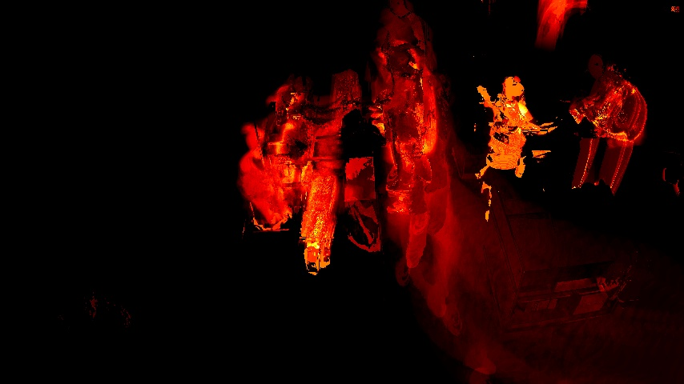
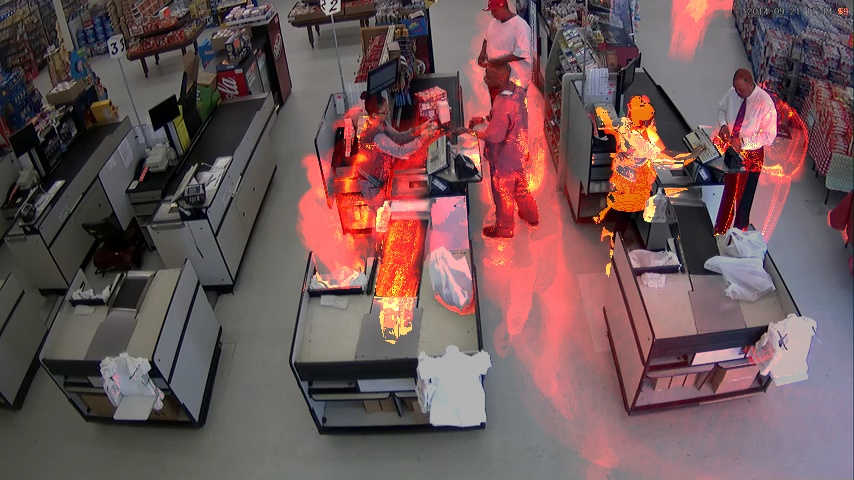

# Mapa de calor

## Para que sirve el sistema?
Este sistema utiliza tecnicas de Backgroud Subtraction para mostrar los lugares donde mas objetos pasaron y de esa manera generar un mapa de calor tanto en video como en imagen.

## Otras funcionalidades

Tambien permite mixear tanto el video original con una capa de calor el cual sigue acumulandose durante todo el video.

Por ende se puede ver en tiempo real los lugares donde mas gente circulo, como se lo ve en la imagen anterior.

## Que tecnologias se usaron?

